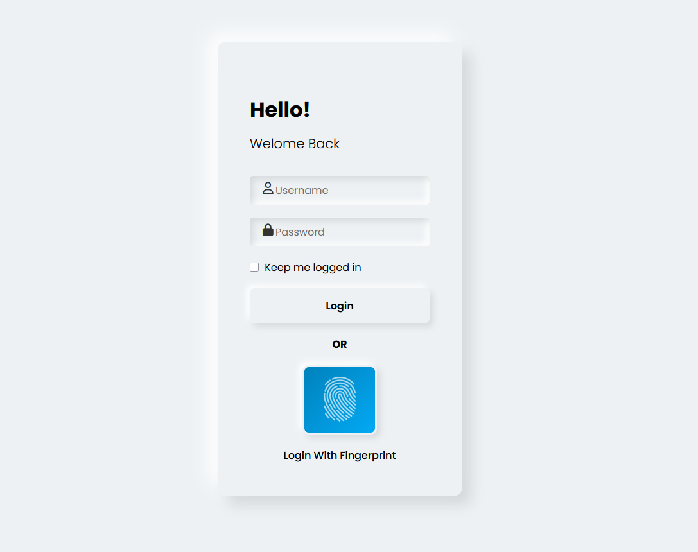
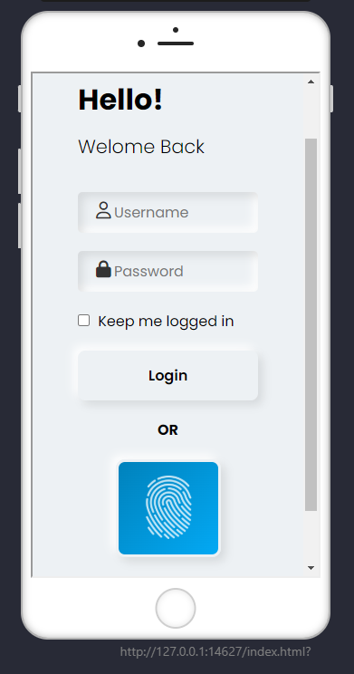

# Login Page With Fingerprint

A modern, responsive login page design featuring biometric (fingerprint) authentication UI. Built with HTML and CSS, this project demonstrates a clean login form with an option to log in using a fingerprint icon, suitable for web and mobile applications.

## Features

- Responsive and modern UI
- Clean login form with username and password fields
- "Keep me logged in" checkbox
- Stylish fingerprint login option
- Animated fingerprint icon
- Google Fonts and Font Awesome integration

## Demo

Desktop View:


Mobile View:


## Getting Started

1. **Clone the repository:**
   ```powershell
   git clone https://github.com/ShahriarTbc/Login_Page_With_Fingerprint.git
   ```
2. **Navigate to the project folder:**
   ```powershell
   cd Login_Page_With_Fingerprint
   ```
3. **Open `index.html` in your browser.**

## Project Structure

```
Login_Page_With_Fingerprint/
│
├── index.html
├── style.css
├── PC-screenshot.png
├── Phone-screenshot.png
└── img/
    └── fingerprint.png
```

## Customization

- Replace `img/fingerprint.png` with your own transparent fingerprint image if needed.
- Edit styles in `style.css` to match your branding.

## Credits

- [Google Fonts - Poppins](https://fonts.google.com/specimen/Poppins)
- [Font Awesome](https://fontawesome.com/)

## License

This project is open source and available under the [MIT License](LICENSE).
